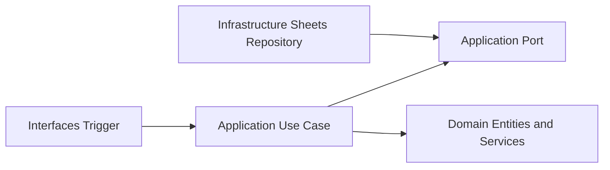

# PEOS Architecture

## Objetivo arquitectonico

Construir un nucleo de negocio portable, con infraestructura intercambiable, para migrar de Google Workspace a una web app sin reescribir casos de uso.

## Estilo

- Clean Architecture por capas.
- Dependencias dirigidas hacia adentro.
- Adaptadores para infraestructura externa.

## Capas actuales

1. Domain
- Entidades y reglas puras (`Order`, `OrderIdGenerator`).
- Sin dependencias de framework.

2. Application
- Casos de uso (`RegisterOrderUseCase`).
- Define puertos (`OrderRepository`).
- Orquesta logica de negocio.

3. Infrastructure
- Implementaciones concretas para Google Sheets.
- Traduce puertos de aplicacion a APIs de Google.

4. Interfaces
- Trigger `onFormSubmit` como punto de entrada.
- Mapping de evento de formulario a input del caso de uso.

## Diagrama de dependencias

## Decisiones tecnicas y justificacion

1. IDs secuenciales por evento y dia (`PEOS-EVENTO-YYYYMMDD-####`)
- Justificacion: facilita operacion manual, conciliacion y soporte.
- Riesgo: contencion futura en alta concurrencia.
- Mitigacion futura: secuencias atomicas o ULID cuando migremos a backend dedicado.

2. Hoja `Orders` separada de respuestas
- Justificacion: desacopla origen del dato de modelo operativo.
- Beneficio: permite evolucionar formulario sin romper almacenamiento canonico.

3. Mapping explicito de campos de formulario
- Justificacion: evita mezclar nombres de preguntas con dominio.
- Beneficio: si cambian etiquetas de Forms, se ajusta solo el adaptador.

4. Build con bundle unico para Apps Script
- Justificacion: Apps Script no ejecuta modulos TypeScript directamente.
- Beneficio: conservamos modularidad en desarrollo y entregamos artefacto compatible.

## Riesgos de escalabilidad detectados

1. Secuencia calculada por lectura de hoja completa.
- Impacto: degrada con volumen alto.
- Plan: indice auxiliar por evento-fecha o contador persistente.

2. Trigger sin cola ni reintentos robustos.
- Impacto: eventos concurrentes podrian generar conflictos.
- Plan: agregar lock transaccional y politica de reintento.

3. Dependencia de estructura de columnas.
- Impacto: cambios manuales en Sheets pueden romper integridad.
- Plan: validacion de esquema al inicio y migraciones controladas.
